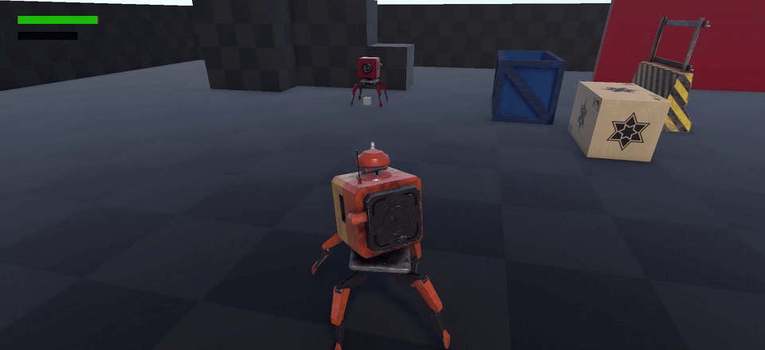

# RoboCube

*A solo-developed soulslike action-adventure in Unity 6 — every system and every asset built by one person.*

[](https://youtu.be/V6h2Ct0Dcvs)
[](https://rohan-samuel.github.io/projects/robocube.html)


<!-- TODO: drop a short gameplay GIF here (turret tracking + overheat bar is the best 6 seconds).
     Put it in ./media/ and reference it as  -->

You wake as a lone machine in a decaying network built by other machines, piecing together what
happened to the world from the data fragments left behind. Combat runs hot rather than tired: there
is no stamina bar, there is a heat gauge, and staying aggressive is what fills it.

**Status: pre-alpha, in active development.** The playable core — movement, camera, the stat and
overheat systems, a turret weapon with aim tracking and projectiles, and multi-slot save/load — is
working. Enemy AI and damage resolution are the current focus.

## Play it

Grab the latest `build.rar` from [Releases](../../releases), extract, and run the `.exe`.

To open the project instead, you need **Unity 6000.5.9f1**. Clone, open the folder through Unity Hub,
and load `Assets/Scenes`. The `Library/` folder is intentionally not committed — Unity rebuilds it on
first open, which takes a few minutes.

## Architecture

The whole project is built on one organising idea: **a character is a thin state object surrounded by
single-responsibility managers**, and the player is a subclass that overrides only what differs.

```
CharacterManager              ← flags, stats, resources, death handling
├── CharacterLocomotionManager
├── CharacterCombatManager
├── CharacterAnimatorManager
├── CharacterEffectsManager
├── CharacterStatsManager
├── CharacterInventoryManager
└── CharacterEquipmentManager
        ▲
        │ inherits + overrides
        │
PlayerManager                 ← adds input, camera, UI, save serialisation
├── PlayerLocomotionManager
├── PlayerCombatManager
├── PlayerInputManager
├── PlayerCamera
├── PlayerUIManager
└── ...
```

`CharacterManager` owns the flags every character needs (`isPerformingAction`, `canRotate`,
`isGrounded`, `isLockedOn`) and the resources they all track. Subsystems read those flags rather than
each other, so behaviours compose without managers needing references to one another — an attack sets
`isPerformingAction`, and locomotion, stat regeneration and the animator each respond independently.

Above the characters sit four world singletons: `WorldSaveGameManager`, `WorldItemDatabase`,
`WorldSoundFXManager` and `WorldCharacterEffectsManager`.

## Engineering notes

Five decisions worth explaining, since they're the ones a reader is most likely to ask about.

**Heat instead of stamina.** Most soulslikes drain a pool you spend. RoboCube inverts it: overheat
*accumulates* from action and decays only once you stop. `CharacterStatsManager.RegenerateOverheating()`
returns early while `isSprinting` or `isPerformingAction` is true, then after a 2-second cooldown
delay bleeds heat off on a 0.1s tick. The effect is that the punish for over-committing arrives a beat
*after* the aggression, rather than during it, and disengaging is an active decision rather than a
pause. Stats feed resources through a single conversion point — `durability` sets max health,
`coolant` sets max heat — so rebalancing means changing one formula, not hunting down constants.

**Weapons are data, not code.** `WeaponItem` is a `ScriptableObject` carrying a model, level
requirement, damage and poise values, and an action reference. The action itself is also a
ScriptableObject (`WeaponItemAction`, subclassed by `LightAttackWeaponItemAction`), so adding a weapon
means authoring an asset in the editor and assigning its behaviour — no changes to the combat code.
The turret is simply the first weapon built on top of it.

**Projectiles sweep instead of stepping.** A fast projectile moved with `transform.Translate` will
tunnel straight through thin colliders on a low frame. `RaycastProjectile` raycasts from *last
frame's* position along exactly this frame's movement distance before it moves, so a hit is detected
even when the travel distance exceeds the target's thickness. Each bullet also self-destructs after
its lifetime, so missed shots can't leak.

**Aim is layered onto animation, not baked into it.** The robot's body aim uses Unity's Animation
Rigging `MultiAimConstraint`, which blends aiming on top of whatever locomotion animation is playing.
`SyncAimTarget` then copies the body's current aim target onto the turret's own constraint each frame,
so the turret and the body track the same point without either one being driven by bespoke code —
and it early-outs when the target hasn't changed.

**Saves are plain JSON.** `CharacterSaveData` is a serialisable POCO holding name, seconds played,
world position, stats and current resources; `SaveFileDataWriter` writes it through `JsonUtility` to
a per-slot file on disk, with slot-occupancy checks and deletion handled up front. Human-readable
saves are worth a lot while a game is still changing shape every week.

## Built with

| Tool | Used for |
|------|----------|
| Unity 6 (6000.5.9f1) | Engine, gameplay scripting, level assembly |
| C# | All gameplay code |
| Unity Input System | Rebindable input via generated `PlayerControls` |
| Unity Animation Rigging | Aim constraints and turret tracking |
| Maya | Modelling, rigging, animation |
| Substance Painter | Texturing |
| Photoshop | UI and concept work |
| FL Studio | Audio |

## Roadmap

| Area | State |
|------|-------|
| Third-person movement & camera | Working |
| Stat system (durability / coolant) | Working |
| Overheat accumulation & decay | Working |
| Weapon & item framework | Working |
| Turret aiming + projectiles | Working |
| Multi-slot save / load | Working |
| Title screen & save-slot UI | Working |
| Enemy AI | In progress |
| Lock-on targeting | Input wired, behaviour in progress |
| Damage resolution | In progress |
| Environment layout | In progress |
| Narrative & data fragments | Planned |

## Credits

Everything here is mine: all gameplay code, the player character's model, rig, textures and
animations, and the project's design. RoboCube is a portfolio piece built to be full-stack on
purpose — the point is to own every layer rather than assemble one.

Built by **Rohan Samuel** — [portfolio](https://rohan-samuel.github.io) ·
[LinkedIn](https://www.linkedin.com/in/r-samuel/) · rohan2309@gmail.com
